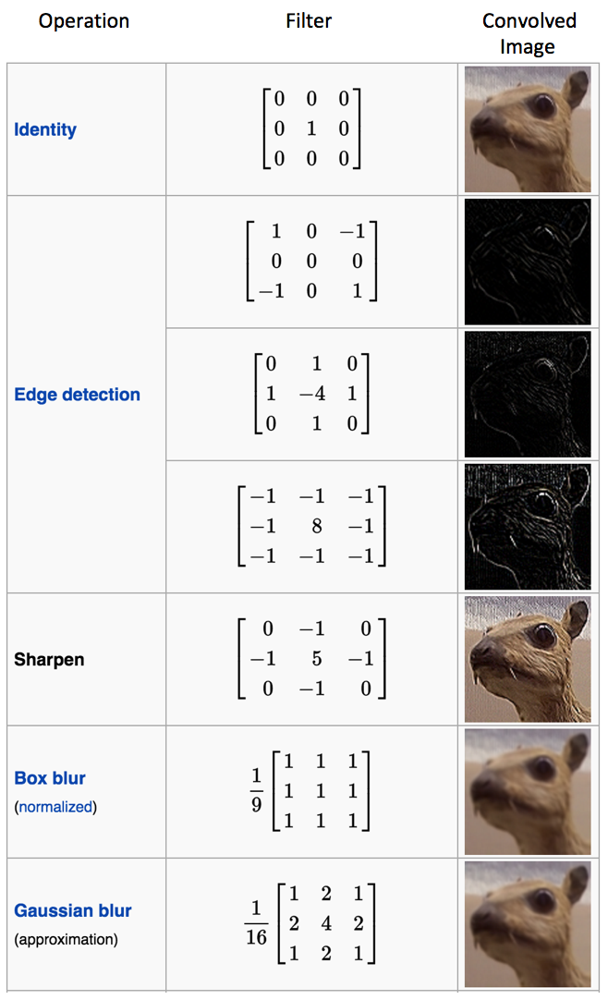
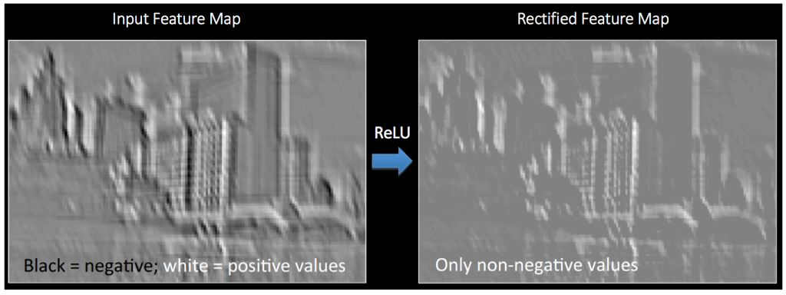
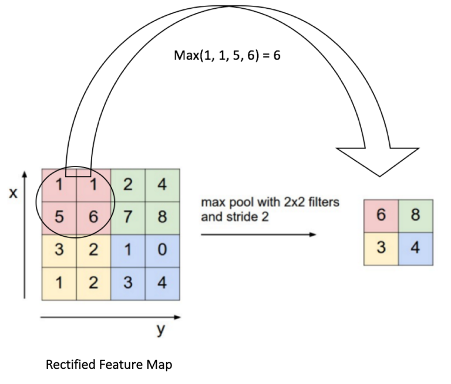

卷积神经网络（Convolutional Neural Network）
============================================================

卷积
------------------------------------------------------------
卷积神经网络的名字来自于其中的卷积操作。卷积的主要目的是为了从输入图像中提取特征。卷积可以通过从输入的一小块数据中学到图像的特征，并可以保留像素间的空间关系。下图为简单的图示：

|convolution_schematic|

在下表中，我们可以看到不同滤波器对上图卷积的效果。正如表中所示，通过在卷积操作前修改滤波矩阵的数值，我们可以进行诸如边缘检测、锐化和模糊等操作。这表明不同的滤波器可以从图中检测到不同的特征，比如边缘、曲线等。

|convolution_feature_table|

另外也可以通过下面这个动画来理解

|giphy|

非线性简介
------------------------------------------------------------
在上图中，每次的卷积操作后都使用了一个叫做 ``ReLU`` 的操作。 ``ReLU``  表示修正线性单元（Rectified Linear Unit），是一个非线性操作，具体操作可以从下图中理解。

|relu_process|

其他非线性函数，比如 tanh 或者 sigmoid 也可以用来替代 ReLU，但 ReLU 在大部分情况下表现是更好的。

池化操作
------------------------------------------------------------
空间池化（Spatial Pooling）（也叫做亚采用或者下采样）降低了各个特征图的维度，但可以保持大部分重要的信息。空间池化有最大化、平均化、加和等几种方式。

下面的图展示了使用 2x2 窗口在修正特征图（在卷积 + ReLU 操作后得到）使用最大池化的例子。

|mal_pooling_sample|

.. |convolution_schematic| image:: ../images/convolution_schematic.gif

.. |giphy| image:: ../images/giphy.gif

参考链接
------------------------------------------------------------
- `An Intuitive Explanation of Convolutional Neural Networks <https://ujjwalkarn.me/2016/08/11/intuitive-explanation-convnets/>`_
